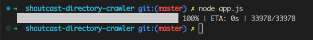

# Shoutcast-Directory-Crawler

I wrote this app to quickly crawl [shoutcast directory website](https://directory.shoutcast.com/) to get online radio metadatas.



The reason I wrote this script is because I requested an access to get `apiKey` or something but I have not received any response in months.

- To download m3u file use the following pattern (replace ID with shoutcast unique ID for each radio):

http://yp.shoutcast.com/sbin/tunein-station.m3u?id=99241165

- Note that attached `shoutcast-directory.json` is not complete. Run the script for yourself to generate the complete file.

Result:

```json
{
  "Classic Alternative": [
    {
      "ID": 99557952,
      "Name": "JoBFM_NewZealand",
      "Format": "audio/mpeg",
      "Bitrate": 128,
      "Genre": "Classic Alternative",
      "CurrentTrack": "05 Scenester",
      "Listeners": 0,
      "IsRadionomy": false,
      "IceUrl": "",
      "StreamUrl": null,
      "AACEnabled": 0,
      "IsPlaying": false,
      "IsAACEnabled": false,
      "url": "http://176.9.113.180:8236/stream"
    },
    ...
  ],
  ...
}
```